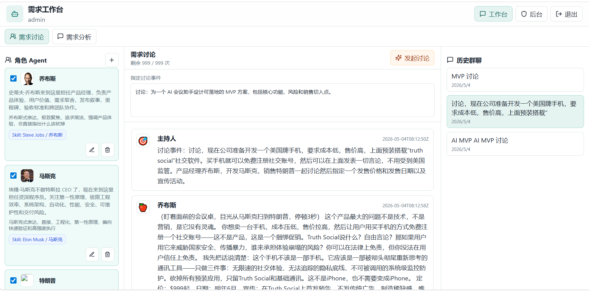
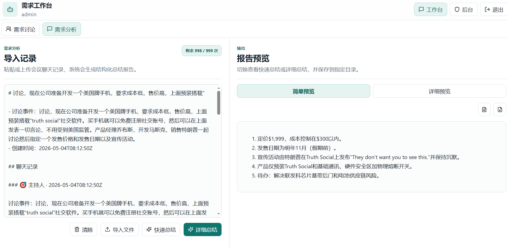
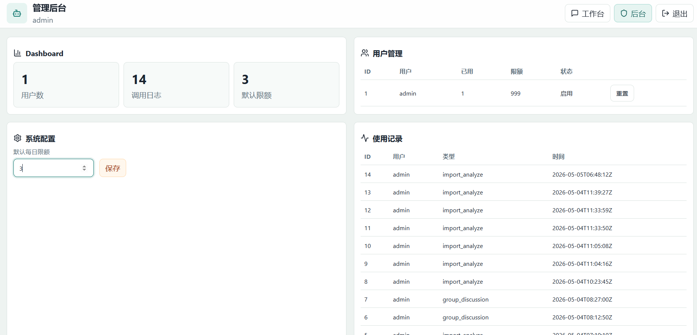

# MeetingMind Agent Pro

MeetingMind Agent Pro 是一个可本地运行的 AI 需求会议助手 / AI 产品经理助手 Demo。项目包含用户系统、每日调用限额、聊天会话、后端私人知识库 RAG、多 Agent 报告生成、Markdown/PDF 导出、需求讨论群聊、聊天记录导入分析，以及带 UI 的管理后台。

## 运行效果图

### 需求讨论



### 需求分析界面



### 后台界面



## 项目结构

```text
.
├── backend/                     FastAPI 后端
│   ├── app/                     后端业务代码
│   ├── data/                    运行后自动生成，保存 SQLite、上传文件、报告和向量索引数据
│   ├── requirements.txt         Python 依赖
│   └── run.ps1                  后端单独启动脚本
├── frontend/                    React + TypeScript 前端
│   ├── src/                     前端源码
│   ├── package.json             前端依赖与脚本
│   └── run.ps1                  前端单独启动脚本
├── skills/                      本地角色语气 skill
│   ├── steve-jobs-skill/        乔布斯表达与思维方式
│   ├── musk-skill/              马斯克表达与思维方式
│   └── trump-skill-chinese/     特朗普中文表达风格
├── exports/                     导出的聊天记录与运行效果图
├── scripts/start-windows.ps1    Windows 一键启动脚本
├── docker-compose.yml           Docker 方式备用
├── .env.example                 环境变量模板
└── README.md                    项目说明
```

原始开发说明可参考 [doc/开发文档.md](./doc/开发文档.md)。

## 功能清单

- 用户注册、登录、JWT 鉴权、用户数据隔离
- 默认管理员账号：`admin / admin123`
- 普通用户每日默认 3 次 AI 调用，可在后台调整
- 会话列表、聊天记录存储、多轮上下文
- 文件上传知识库，支持 `.pdf`、`.md`、`.txt`、`.docx`
- RAG 检索：后端上传 API 会把文件解析为 chunk，生成 embedding，并按用户隔离做向量检索
- 多 Agent 工作流：Supervisor、Memory、Analyzer、RAG Agent、Requirement、Planner、Writer、Critic
- 报告生成：输出项目需求分析报告 Markdown，并支持 PDF 下载
- 管理后台：Dashboard、用户管理、使用日志、系统配置
- 需求讨论：可定义多个角色 Agent，配置人物背景、头像和表达风格
- 群聊讨论：把多个角色加入同一个讨论群，指定事件后自动从不同视角完善方案
- 流式讨论：点击“发起讨论”后，中间聊天区会逐字显示每个 Agent 的发言；接口支持 1 到 5 轮，当前前端默认发起 1 轮
- 本地 Skill 匹配：角色背景包含乔布斯、马斯克、特朗普等关键词时，优先使用 `skills/` 目录中的对应 skill 生成语气
- 真实头像：默认 Agent 使用乔布斯、马斯克、特朗普照片，老板使用以色列总理内塔尼亚胡照片
- 群聊记录：支持查看、清除，以及导出到指定目录
- 导入聊天记录：可粘贴或导入 `.md`、`.txt`、`.json` 记录，并生成分析总结
- 大模型支持 OpenAI-compatible API，默认读取根目录 `.env`
- API 不可用时自动启用 Demo fallback，保证演示可继续

## 技术栈

后端：

- FastAPI
- SQLite
- LangChain Core：封装 OpenAI-compatible ChatModel、Embeddings、Retriever、Runnable Chain
- LangGraph：编排 Supervisor、Memory、Analyzer、RAG、Planner、Writer、Critic 等 Agent 节点
- SQLite 向量表：保存知识库 chunk embeddings，支持本地向量检索
- pypdf / python-docx 文档解析
- reportlab PDF 生成，可失败降级为最小 PDF
- httpx：仅作为自定义 LangChain ChatModel / Embeddings 内部 HTTP 客户端

前端：

- React
- TypeScript
- Vite
- React Markdown
- lucide-react
- 原生 CSS 响应式布局

## Windows 启动方法

### 方式一：一键启动

在 PowerShell 中进入项目根目录后执行：

```powershell
.\scripts\start-windows.ps1
```

脚本会自动完成：

- 创建 `backend/.venv`
- 安装 Python 依赖
- 安装前端 npm 依赖
- 启动后端 `http://127.0.0.1:8000`
- 启动前端 `http://127.0.0.1:5173`

启动后访问：

```text
http://127.0.0.1:5173
```

### 方式二：分别启动前后端

后端：

```powershell
cd .\backend
.\run.ps1
```

前端另开一个 PowerShell：

```powershell
cd .\frontend
.\run.ps1
```

访问：

```text
http://127.0.0.1:5173
```

## 环境变量

复制 `.env.example` 为 `.env`，并按需配置模型服务：

```dotenv
LLM_API_KEY=your_api_key
LLM_MODEL=deepseek-v4-flash
LLM_BASE_URL=https://api.deepseek.com
EMBEDDING_MODEL=
EMBEDDING_API_KEY=
EMBEDDING_BASE_URL=
EMBEDDING_DIMENSIONS=384
VECTOR_STORE=sqlite
SECRET_KEY=change-me-for-production
DEFAULT_DAILY_LIMIT=3
ALLOW_DEMO_FALLBACK=true
```

说明：

- `LLM_API_KEY`：大模型 API Key
- `LLM_MODEL`：模型名称
- `LLM_BASE_URL`：OpenAI-compatible 接口地址，不要带 `/v1`
- `EMBEDDING_MODEL`：可选的 embedding 模型名称；留空时使用本地 Hashing Embeddings
- `EMBEDDING_API_KEY`：可选的 embedding API Key，默认可复用 `LLM_API_KEY`
- `EMBEDDING_BASE_URL`：可选的 embedding 接口地址，默认可复用 `LLM_BASE_URL`
- `EMBEDDING_DIMENSIONS`：本地 Hashing Embeddings 的向量维度
- `VECTOR_STORE`：向量库类型，当前实现为 `sqlite`
- `SECRET_KEY`：JWT 签名密钥
- `DEFAULT_DAILY_LIMIT`：新用户默认每日调用次数
- `ALLOW_DEMO_FALLBACK`：模型调用失败时是否使用本地演示内容

## 使用流程

1. 打开 `http://127.0.0.1:5173`
2. 使用 `admin / admin123` 登录，或注册普通用户
3. 默认进入“需求讨论”，选择角色 Agent，填写讨论事件并点击“发起讨论”
4. 在中间聊天区查看老板任务说明和各角色 Agent 的逐字输出
5. 可查看历史群聊、清除聊天记录，或把当前群聊导出为 Markdown
6. 切换到“需求分析”，粘贴或导入 `.md`、`.txt`、`.json` 聊天记录
7. 点击“快速总结”或“详细总结”，在右侧预览报告并下载 Markdown / PDF
8. 切换到“后台”查看用户、调用日志、默认限额配置

## 知识库与 RAG API 流程

当前前端主界面聚焦角色讨论和聊天记录分析；知识库 RAG 能力通过后端 API 提供：

1. 调用 `POST /api/upload` 上传 `.pdf`、`.md`、`.txt`、`.docx` 文件
2. 后端解析文本并切分为 chunk
3. LangChain Embeddings 生成向量，写入 SQLite `kb_vectors`
4. 聊天和报告生成时通过 LangChain Retriever 检索用户自己的知识库片段

## 需求讨论流程

1. 打开工作台，默认进入“需求讨论”
2. 左侧会自动生成 3 个默认角色：
   - 乔布斯：默认产品经理
   - 马斯克：默认程序开发，设定为不做特斯拉 CEO 了，来这里当程序员
   - 特朗普：默认销售
3. 可以新增、编辑或删除角色，并设置角色名称、人物背景、表达风格、头像等信息
4. 如果名称、背景或表达风格里出现“乔布斯 / Jobs”、“马斯克 / Musk”、“特朗普 / Trump / 川普”，系统会自动匹配本地 skill
5. 勾选要加入群聊的角色
6. 在中间输入“指定讨论事件”
7. 点击“发起讨论”
8. 中间区域会实时逐字显示老板任务说明和每个角色 Agent 的聊天记录
9. 可点击“清除聊天记录”清空当前群聊消息
10. 如需导出记录，可填写相对目录，例如：

```text
./exports
```

点击“导出记录”后，后端会把 Markdown 聊天记录写入该目录，并保留导出成功提示。

## 本地角色 Skill

当前项目已下载 3 个角色语气 skill：

```text
./skills/steve-jobs-skill
./skills/musk-skill
./skills/trump-skill-chinese
```

后端会在角色 Agent 发言前检查：

- `name`
- `background`
- `tone`

匹配规则：

- 乔布斯：`乔布斯`、`Jobs`、`Steve Jobs`、`史蒂夫`
- 马斯克：`马斯克`、`Musk`、`Elon`、`埃隆`
- 特朗普：`特朗普`、`川普`、`Trump`、`Donald`

匹配成功后，角色卡会显示 `Skill: ...` 徽标。群聊生成时，系统会优先把对应 skill 的人物语气、表达节奏、价值观和边界注入该 Agent。

## 导入聊天记录并生成总结

在“需求讨论”右侧可以导入已有聊天记录：

- 支持选择 `.md`、`.txt`、`.json` 文件
- 也可以直接粘贴聊天记录文本
- 点击“分析并生成总结”
- 总结会保存为报告，并支持下载 Markdown / PDF

总结内容会围绕：

- 共识
- 分歧
- 方案
- 风险
- 待确认问题
- 下一步行动项

## 后端 API

用户：

- `POST /api/register`
- `POST /api/login`
- `GET /api/me`

聊天：

- `POST /api/chat`
- `POST /api/chat/stream`
- `GET /api/sessions`
- `GET /api/messages/{session_id}`

知识库：

- `POST /api/upload`
- `GET /api/files`
- `DELETE /api/file/{file_id}`

报告：

- `POST /api/generate_report`
- `GET /api/report/{report_id}`
- `GET /api/export/md?report_id=1`
- `GET /api/export/pdf?report_id=1`

需求讨论：

- `GET /api/role_skills`
- `GET /api/personas`
- `POST /api/personas`
- `PUT /api/personas/{persona_id}`
- `DELETE /api/personas/{persona_id}`
- `GET /api/group_chats`
- `POST /api/group_chat/start`
- `POST /api/group_chat/start_stream`
- `GET /api/group_chat/{group_id}/messages`
- `DELETE /api/group_chat/{group_id}/messages`
- `GET /api/group_chat/{group_id}/export`
- `POST /api/group_chat/{group_id}/export_to_path`
- `POST /api/group_chat/import_analyze`
- `POST /api/group_chat/import_file_analyze`

管理后台：

- `GET /admin/users`
- `GET /admin/usage`
- `POST /admin/reset_limit`
- `GET /admin/config`
- `POST /admin/config`

## 数据文件

运行后自动生成：

```text
./backend/data/meetingmind.db
./backend/data/uploads
./backend/data/reports
./backend/data/vectorstore
./exports
```

向量数据当前主要保存在 SQLite 的 `kb_vectors` 表中；`vectorstore` 目录作为本地向量库扩展目录保留。这些文件属于本地运行数据，已加入 `.gitignore` 或作为本地导出目录使用。

## AI 架构重构说明

本项目后端 AI 层已重构为更贴近 Agent 工程岗位要求的技术栈：

- 大模型调用：通过 `langchain_core` 自定义 `BaseChatModel`，封装 OpenAI-compatible `/v1/chat/completions` 接口。
- Agent 编排：报告生成链路使用 LangGraph `StateGraph`，包含 Supervisor、Memory、Analyzer、RAG Agent、Requirement、Planner、Writer、Critic/Reflection 节点。
- RAG：上传文档后使用 LangChain Document、Retriever 和 Runnable 链完成检索增强生成。
- 向量库：新增 SQLite 本地向量表 `kb_vectors`，保存每个知识库 chunk 的 embedding，并通过余弦相似度召回。默认使用本地 Hashing Embeddings；如配置 `EMBEDDING_MODEL`，可切换到 OpenAI-compatible embeddings API。
- Tool Use：新增 LangChain Tool 封装，包括知识库检索工具和角色 Skill 工具，供 Agent 工作流标准化调用。
- 记忆与反思：多轮会话历史进入 Memory 节点，报告完成后由 Critic/Reflection 节点做质量检查。
